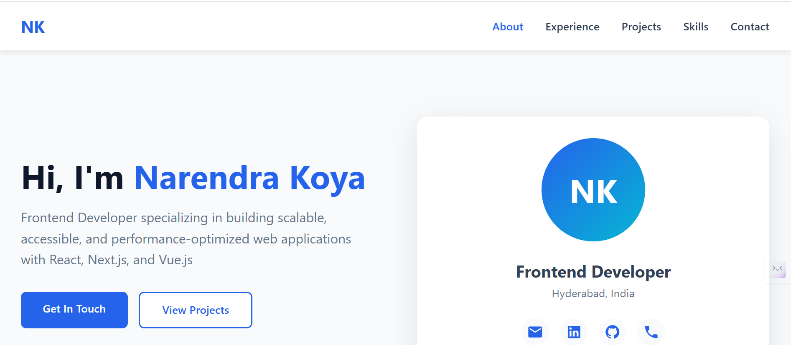
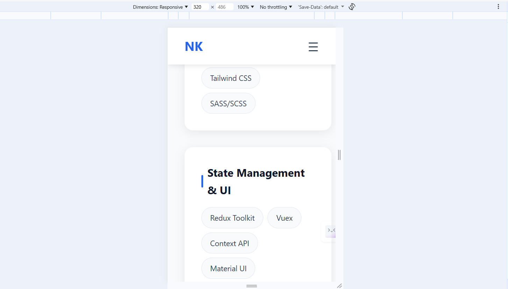
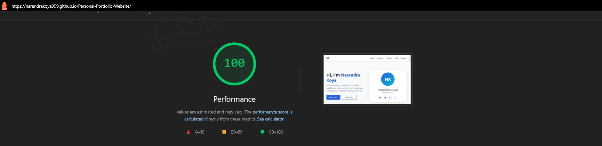
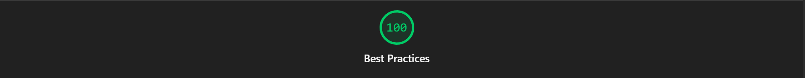

# 🚀 Personal Portfolio Website - Narendra Koya

[](https://opensource.org/licenses/MIT)
[](https://developer.mozilla.org/en-US/docs/Web/HTML)
[](https://developer.mozilla.org/en-US/docs/Web/CSS)
[](https://developer.mozilla.org/en-US/docs/Web/JavaScript)
[](https://developers.google.com/web/tools/lighthouse)

➡️A modern, responsive, and accessible portfolio website built with vanilla HTML, CSS, and JavaScript. Designed to showcase professional experience, projects, and skills with optimal performance and user experience.

## 👀Note: It is recommended to run Lighthouse tests in Incognito Mode, since browser extensions in regular mode may negatively impact the performance score.

## 🌟 Live Demo

[View Live Portfolio](https://narendrakoya999.github.io/Personal-Portfolio-Website/)

## 📸 Screenshots

### Desktop View


### Mobile View


### Lighthouse Score - Performance


### Lighthouse Score - Accessibility


### Lighthouse Score - Best Practices


### Lighthouse Score - SEO


## ✨ Features

### 🎨 Design & UX
- **Modern UI Design** - Clean, professional interface with smooth animations
- **Fully Responsive** - Seamless experience across mobile, tablet, and desktop devices
- **Dark Mode Ready** - Color scheme optimized for visual comfort
- **Interactive Elements** - Hover effects, smooth scrolling, and dynamic animations
- **Custom Tooltips** - Professional SVG icons with informative tooltips

### ♿ Accessibility (WCAG Compliant)
- **Semantic HTML5** - Proper document structure with landmarks
- **ARIA Attributes** - Screen reader friendly with proper labels
- **Keyboard Navigation** - Full keyboard accessibility support
- **Proper Heading Hierarchy** - Sequential heading structure (H1 → H2 → H3)
- **Focus Management** - Clear focus indicators for interactive elements
- **Alt Text** - Descriptive alternative text for all visual elements

### ⚡ Performance Optimization
- **Optimized Assets** - Efficient use of SVG icons and CSS
- **Minimal Dependencies** - Zero external libraries (vanilla JavaScript)
- **Fast Load Time** - Optimized for Core Web Vitals
- **CSS Animations** - Hardware-accelerated transitions
- **Lazy Loading** - Intersection Observer for fade-in animations

### 🔍 SEO Optimized
- **Meta Tags** - Comprehensive SEO meta information
- **Semantic Structure** - Proper HTML5 semantic elements
- **Descriptive Content** - Clear and relevant content for search engines
- **Mobile-First** - Optimized for mobile search rankings

## 🏆 Lighthouse Scores

Achieved perfect scores across all categories:

| Category | Score |
|----------|-------|
| 🚀 Performance | 100/100 |
| ♿ Accessibility | 100/100 |
| 💡 Best Practices | 100/100 |
| 🔍 SEO | 100/100 |

## 🛠️ Technologies Used

### Core Technologies
- **HTML5** - Semantic markup and structure
- **CSS3** - Modern styling with Flexbox and Grid
- **JavaScript (ES6+)** - DOM manipulation and interactivity

### Key Features Implemented
- **CSS Variables** - Custom properties for theming
- **Flexbox & Grid** - Modern layout systems
- **Intersection Observer API** - Scroll animations
- **Event Delegation** - Efficient event handling
- **Responsive Design** - Mobile-first approach with media queries
- **CSS Animations** - Keyframe animations and transitions

## 📂 Project Structure

```
portfolio-website/
│
├── index.html              # Main HTML file
├── style.css               # Stylesheet with all CSS
├── script.js               # JavaScript for interactivity
├── README.md               # Project documentation
│
└── screenshots/            # Lighthouse scores and preview images
    ├── desktop-view.png
    ├── mobile-view.png
    ├── lighthouse-performance.png
    ├── lighthouse-accessibility.png
    ├── lighthouse-best-practices.png
    └── lighthouse-seo.png
```

## 🎯 Key Sections

1. **Hero Section** - Introduction with professional branding
2. **Professional Experience** - Work history with detailed achievements
3. **Featured Projects** - Showcase of major projects
4. **Skills & Technologies** - Categorized technical skills
5. **Contact Section** - Multiple contact methods with tooltips

## 🚀 Getting Started

### Prerequisites
- A modern web browser (Chrome, Firefox, Safari, Edge)
- Basic text editor (VS Code recommended)
- (Optional) Local server for development

### Installation

1. **Clone the repository**
   ```bash
   git clone https://github.com/NarendraKoya999/Personal-Portfolio-Website.git
   cd Personal-Portfolio-Website
   ```

2. **Open the project**
   ```bash
   # Simply open index.html in your browser
   # OR use a local server (recommended)
   ```

3. **Using Live Server (VS Code)**
   - Install "Live Server" extension
   - Right-click on `index.html`
   - Select "Open with Live Server"

### Customization

1. **Personal Information**
   - Update contact details in `index.html`
   - Modify experience and projects sections
   - Update social media links

2. **Styling**
   - Adjust CSS variables in `style.css` for color customization
   - Modify layout and spacing as needed
   - Update animations and transitions

3. **Content**
   - Replace placeholder content with your information
   - Add your own projects and achievements
   - Update skills and technologies

## 📱 Responsive Breakpoints

```css
/* Mobile First Approach */
- Mobile: 320px - 767px
- Tablet: 768px - 1023px
- Desktop: 1024px and above
```

## ♿ Accessibility Features

- ✅ Semantic HTML5 landmarks (`<header>`, `<main>`, `<nav>`, `<footer>`)
- ✅ ARIA labels for all interactive elements
- ✅ Proper heading hierarchy (H1 → H2 → H3)
- ✅ Keyboard navigation support
- ✅ Focus indicators for interactive elements
- ✅ Screen reader friendly tooltips
- ✅ High contrast color scheme
- ✅ Touch-friendly interactive elements (minimum 44px)

## 🎨 Color Palette

```css
--primary: #2563eb      /* Blue */
--primary-dark: #1e40af /* Dark Blue */
--secondary: #64748b    /* Gray */
--dark: #0f172a         /* Dark Background */
--light: #f8fafc        /* Light Background */
--accent: #06b6d4       /* Cyan */
--text: #334155         /* Text Color */
--border: #e2e8f0       /* Border Color */
```

## 🔧 Browser Support

- ✅ Chrome (latest)
- ✅ Firefox (latest)
- ✅ Safari (latest)
- ✅ Edge (latest)
- ✅ Opera (latest)

## 📈 Performance Metrics

- **First Contentful Paint (FCP)**: < 1.0s
- **Largest Contentful Paint (LCP)**: < 2.5s
- **Cumulative Layout Shift (CLS)**: < 0.1
- **Time to Interactive (TTI)**: < 3.0s (TTI (Time to Interactive) is no longer shown in Lighthouse Performance reports.)
- **Total Blocking Time (TBT)**: < 200ms
- **Speed Index**: < 3.4s

## 🎓 Learning Outcomes

This project demonstrates proficiency in:
- ✅ Semantic HTML5 structure
- ✅ Modern CSS3 techniques (Flexbox, Grid, Custom Properties)
- ✅ Vanilla JavaScript DOM manipulation
- ✅ Responsive web design principles
- ✅ Web accessibility standards (WCAG 2.1)
- ✅ Performance optimization
- ✅ SEO best practices
- ✅ Clean code organization

## 🌐 Deployment

### GitHub Pages
```bash
# Push to GitHub
git add .
git commit -m "Initial commit"
git push origin main

# Enable GitHub Pages in repository settings
# Select branch: main
# Select folder: / (root)
```

### Netlify
1. Drag and drop project folder to Netlify
2. Or connect GitHub repository
3. Deploy automatically

### Vercel
```bash
# Install Vercel CLI
npm i -g vercel

# Deploy
vercel
```

## 📄 License

This project is licensed under the MIT License - see the [MIT License](https://opensource.org/licenses/MIT) for details.

## 👤 Author

**Narendra Koya**
- 🌐 Website: [Your Website](https://narendrakoya999.github.io/Personal-Portfolio-Website/)
- 💼 LinkedIn: [linkedin.com/in/narendra-koya](https://linkedin.com/in/narendra-koya)
- 🐙 GitHub: [@NarendraKoya999](https://github.com/NarendraKoya999)
- 📧 Email: narendra.koya.in@gmail.com
- 📱 Phone: +91 7032359307

## 🤝 Contributing

Contributions, issues, and feature requests are welcome!

1. Fork the project
2. Create your feature branch (`git checkout -b feature/AmazingFeature`)
3. Commit your changes (`git commit -m 'Add some AmazingFeature'`)
4. Push to the branch (`git push origin feature/AmazingFeature`)
5. Open a Pull Request

## 📝 Changelog

### Version 1.0.0 (2025-02-11)
- ✨ Initial release
- 🎨 Modern responsive design
- ♿ WCAG 2.1 AA compliant
- 🚀 100/100 Lighthouse scores
- 📱 Mobile-first responsive layout
- 🎯 Interactive tooltips and animations

## 🙏 Acknowledgments

- Inspiration from modern portfolio designs
- Icons: Custom SVG icons
- Fonts: System fonts for optimal performance
- Color Palette: Tailwind CSS inspired

## 📞 Contact & Support

For any queries or support, feel free to reach out:
- 📧 Email: narendra.koya.in@gmail.com
- 💼 LinkedIn: [Narendra Koya](https://linkedin.com/in/narendra-koya)
- 🐙 GitHub: [@NarendraKoya999](https://github.com/NarendraKoya999)

---

<div align="center">

### ⭐ Star this repository if you find it helpful!

**Made with ❤️ by Narendra Koya**

</div>
